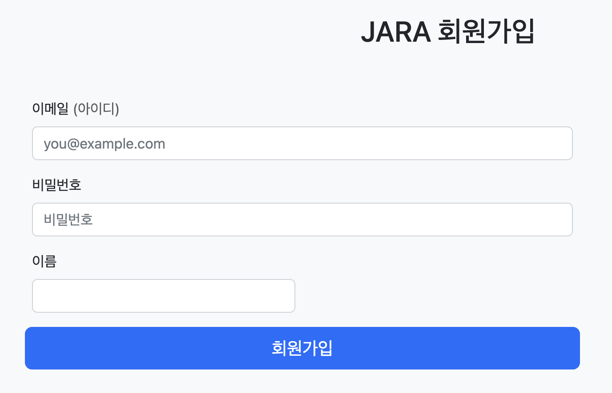
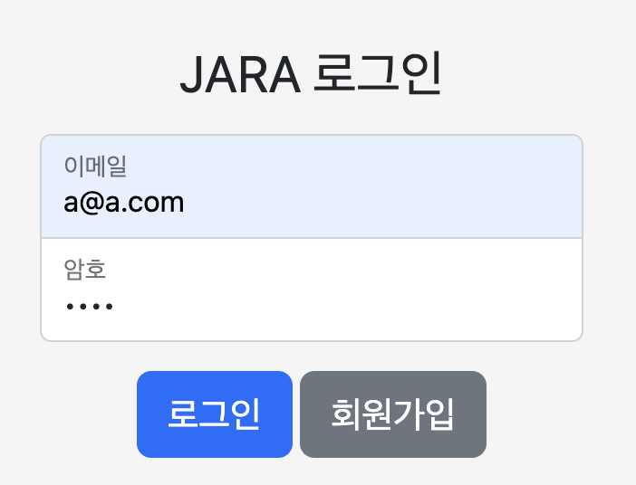
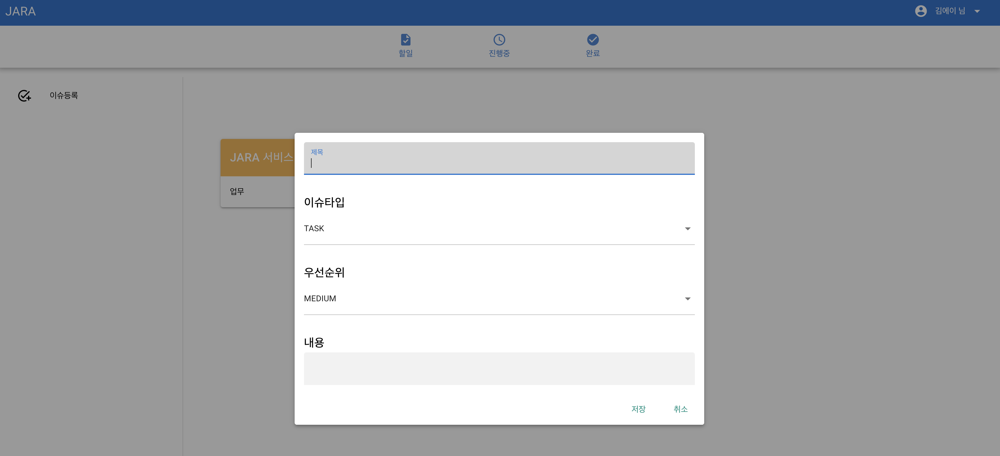
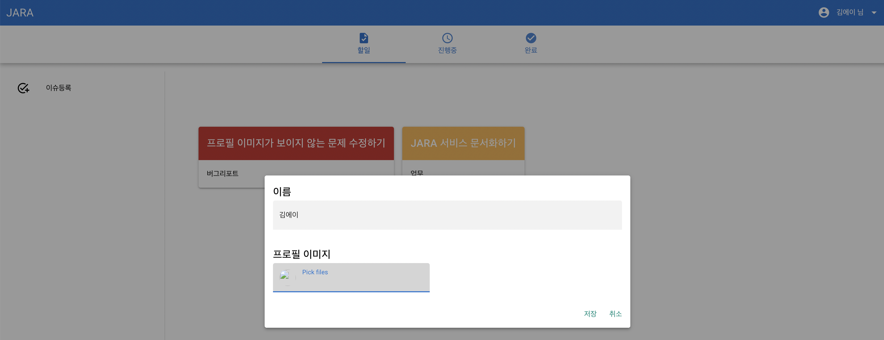
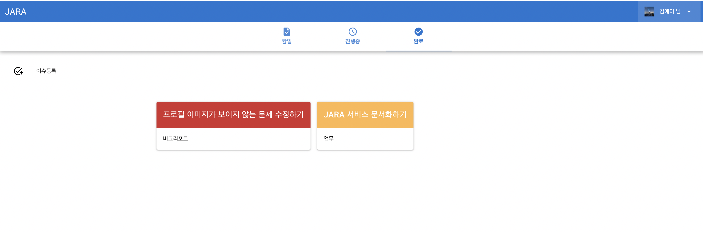

# JARA :whale:
- Issue service
  - Spring Web MVC
  - JPA
- User service
  - Spring Webflux with coroutine
  - R2DBC

## 1) Signup

## 2) Sign-in

## 3) Create an issue

## 4) Modify my profile

## 5) Resolve issues

